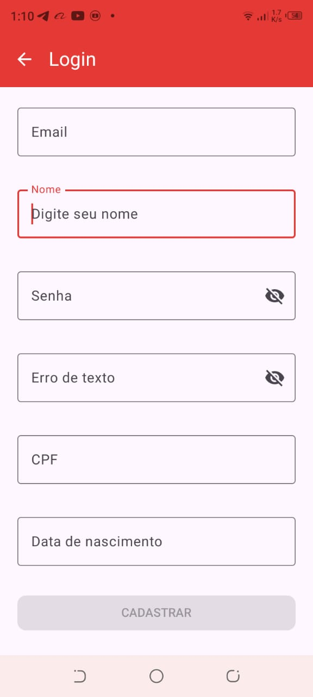
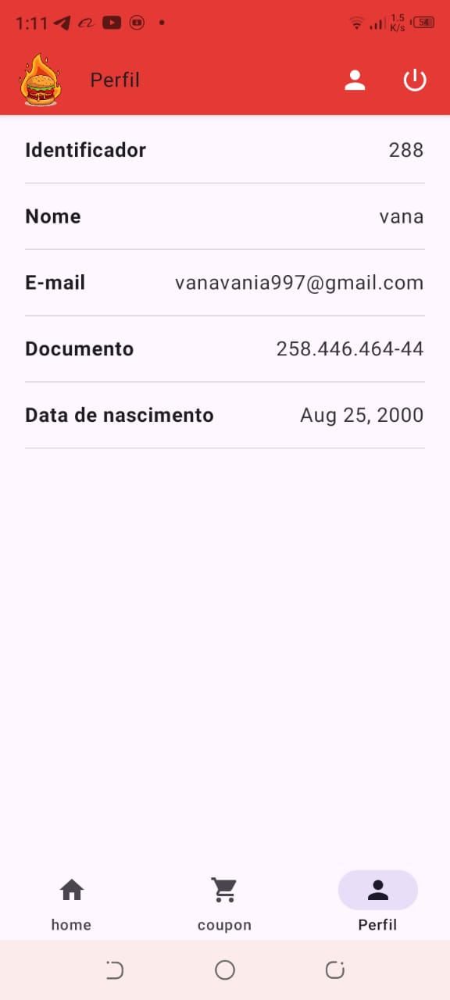

# KingBurguer

É um aplicativo de comida onde o usuário pode se cadastrar e fazer login.

O usuário pode selecionar uma comida, ver detalhes, gerar cupons e acompanhar cupons ativos e expirados.

---

## 🛠 Tecnologias Utilizadas

- Kotlin
- Jetpack Compose
- MVVM
- Navigation Compose
- Material 3
- Retrofit
- Hilt
- DataStore
- Splash Screen
- Coil
- Material
- Dager Hilt

---

## 📸 Capturas de Tela

  
  
  

  
  
  

  

## 🎥 App Demo

  

---

## 📚 O que eu aprendi
- Como estruturar uma tela de Cadastro
- Como estruturar um projeto com MVVM
- Como gerenciar estado no Compose
- Como usar o Hilt
- Como usar o DataStore
- Como usar o Splash Screen
- Sistema de Requisicao com Retrofit
- Como usar Navigation
- Boas práticas de organização de código

---

## 🚀 Melhorias futuras

- Implementar Room Database
- Implementar Offline First
- Adicionar testes unitários
- Melhorar UI/UX

